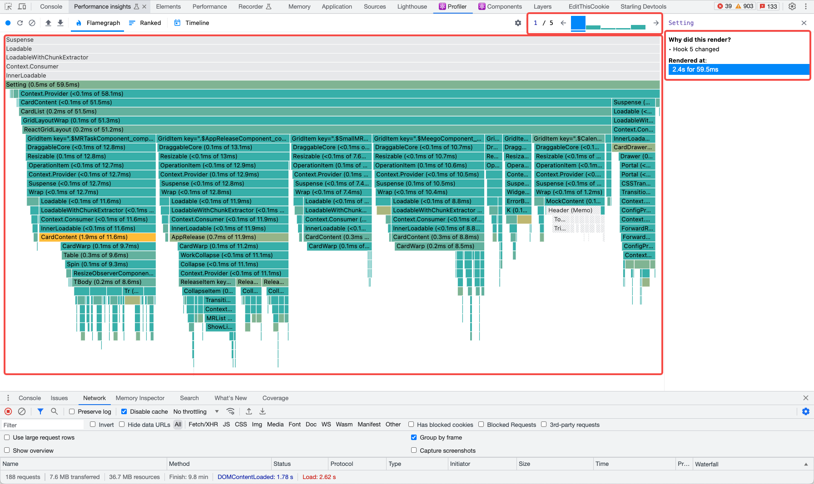
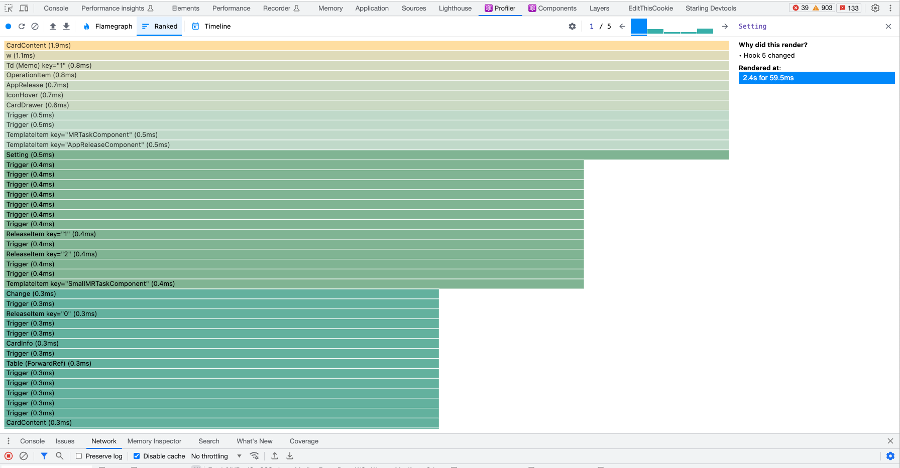
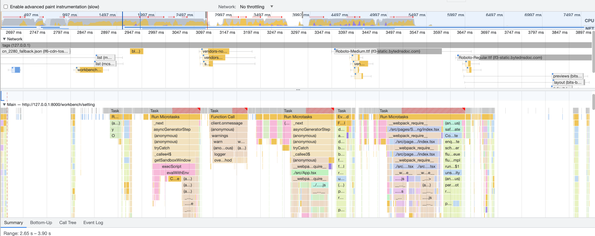

# Profiler 调试工具

React Profiler 是 react 提供的性能分析工具，我们可以使用它来分析在一次 render 中每个组件的耗时，以及导致它 render 的原因，具体界面如下图

上方一列代表一次 render，柱子的长度代表耗时长短，下方是 render 的火焰图，可以知道每个组件的耗时

支持所有组件按耗时排序，找到最耗时的组件进行优化

相比于 performance，可以更清晰的分析 react 组件的性能，performance 主要用于分析资源加载的性能，以优化资源加载方式，但无法像 profiler 这样给到具体组件的执行时间，可以看到大部分的函数调用都是 react 自身的方法，对与开发者来说难以看懂

