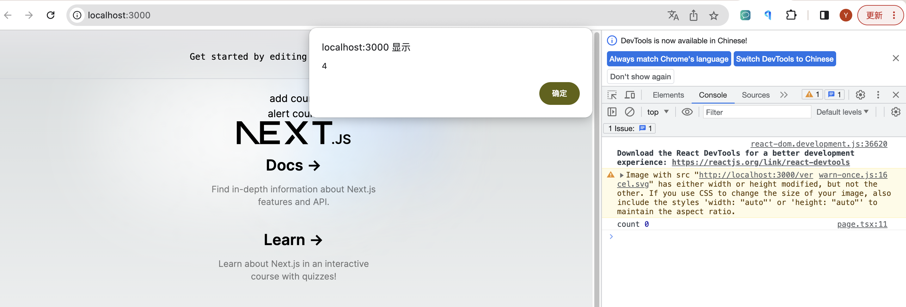
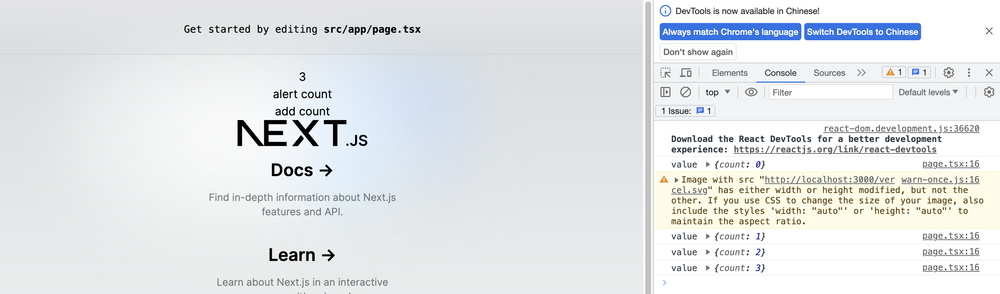

# ref使用技巧

## 监听ref更新

我们在使用react开发的过程中，常常会使用ref来保存一些不需要触发render但又会更新值的数据，但有时候我们需要子组件提供一些方法供上层组件消费，此时我们需要监听子组件提供的值，并触发更新，这时ref的一般用法就无法满足我们的需求，举个例子

```typescript
function App(){
    const ref = useRef<{count?: number}>()

    useEffect(() => {
        console.log('count', ref.current?.count)
    },[ref.current?.count])

    return (
        <div>
            {ref.current?.count}
            <div onClick={() => alert(ref.current?.count)}>alert count</div>
            <Component ref={ref} />
        </div>
    )
}

function Component(_, ref){
    const [count, setCount] = useState(0)

    useImperativeHandle(ref, () => ({
        count
    }))

    return (
        <div onClick={() => setCount(count+1)}>add count</div>
    )
}
```
点击add count，并没有触发useEffect输出count的值，且因为没有触发render，ref.current?.count的值也没有渲染到页面上，但是点击alert count却能看到count的值是更新后的




我们可以使用`Callback Refs`方式，传入一个回调给子应用的ref属性，而非一个useRef返回的ref变量，[react官方文档](https://react.dev/reference/react-dom/components/common#ref-callback)

```typescript
function App(){
    const [count,  setCount] = useState()

    const callback = useCallback((value: any) => {
        if(value) {
            console.log('value',value)
            setCount(value?.count)
        }
    }, [])

    return (
        <div>
            {count}
            <div onClick={() => alert(count)}>alert count</div>
            <Component ref={callback} />
        </div>
    )
}

function Component(_, ref){
    const [count, setCount] = useState(0)

    useImperativeHandle(ref, () => ({
        count
    }))

    return (
        <div onClick={() => setCount(count+1)}>add count</div>
    )
}
```

可以看到页面的数字每次点击add count都会更新



还可以直接用dispatch作为callback ref

```typescript
function App(){
    const [ref,  setRef] = useState<{count?: number}>()

    return (
        <div>
            {ref?.count}
            <div onClick={() => alert(ref?.count)}>alert count</div>
            <Component ref={setRef} />
        </div>
    )
}
```

有人可能会想问既然父组件还要写useState，那为什么不直接把子组件的useState提到上层呢，确实这样也是可行的，但有时候我们可能会更希望子组件自身足够解耦，不需要依赖父组件传入state和setState方法，况且如果子组件作为npm包，或者module fedration远程组件来消费，将状态保存在子组件内部会是一个更好的组织方式。