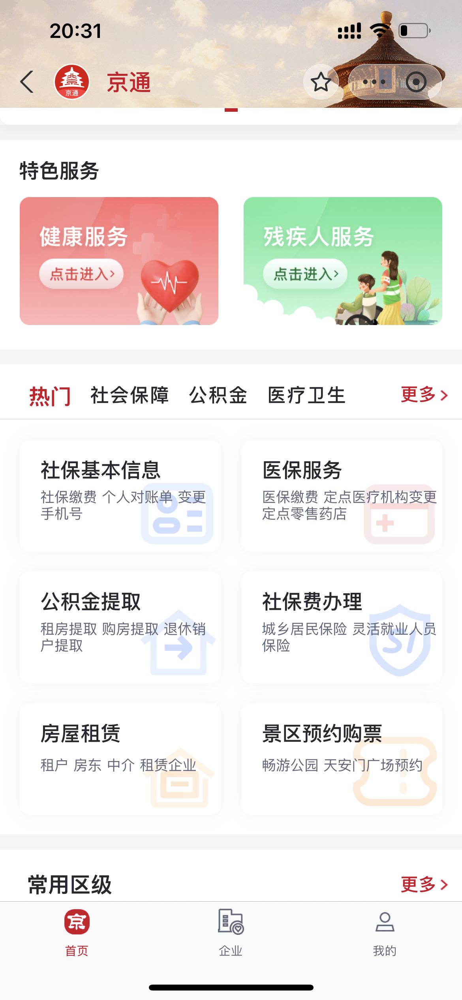
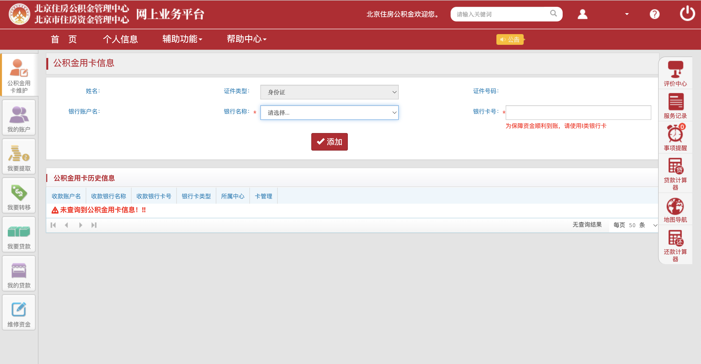

# 租房公积金提取

打工人每个月的工资有一部分会作为作为公积金储存起来，公积金的存储金额，一半由员工出，另一半由公司出，一般买房的时候才能全额提取，但也可以提取一部分用于支付租房租金。记录下整个操作流程（适用于北京）

1. 打开支付宝搜索‘京通’找到京通小程序

2. 在下方找到公积金一栏，点开公积金提取，继续选择租房提取公积金

3. 之后选择公积金用卡，提起申请即可

4. 如果不存在公积金用卡，可以参考[如何使用公积金用卡提取住房公积金](https://gjj.beijing.gov.cn/web/zwfw5/1736744/10927953/index.html)

5. 登录[住房公积金个人网上业务平台](https://gjj.beijing.gov.cn/web/index/grwsywpt/index.html)

6. 点击公积金用卡维护，填写银行名称和卡号即可，普通收工资的银行卡就可以，之后再回到申请表单就有公积金用卡的选项了

